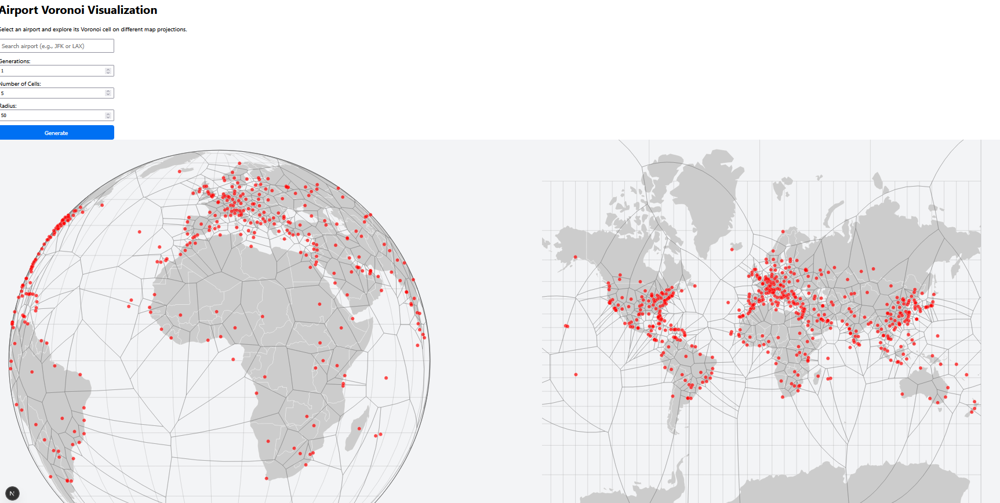
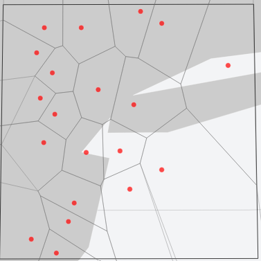
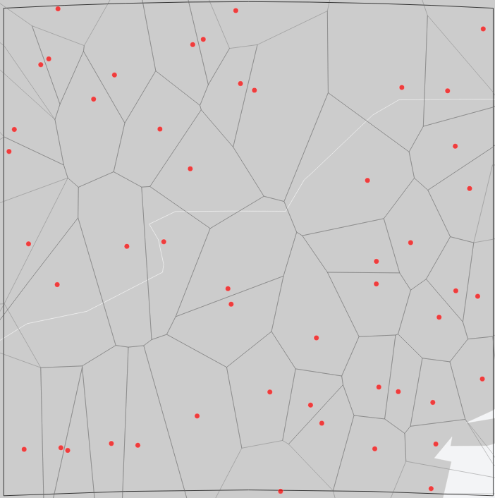
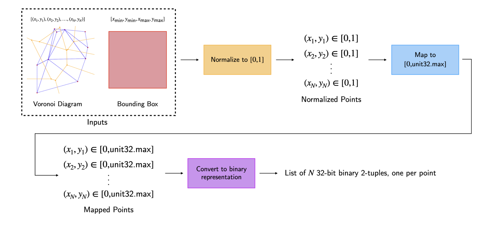

# Airspace Sectorization via Voronoi Diagrams for CSCI 716 - Computational Geometry 
By Audrey Fuller (alf9310@rit.edu), Ricky Gupta (rg4825@rit.edu) and Lauren Kaestle (lk2958@rit.edu)

We aim to optimize airspace “sectors” by generating Voronoi diagrams whose seed points are evolved using a genetic algorithm. The goal is to reduce air-traffic controller workload by creating sector boundaries that better balance aircraft density, crossover frequency, and dwell time.



## Background Information
Airspace is divided into sectors that determine which air-traffic controller tracks each aircraft. Poorly designed sectors can overload controllers or produce excessive handoffs between sectors. Prior research proposes optimization-based approaches, but practical tools that allow interactive exploration of airspace designs (especially using real flight data) are limited.

## Algorithm Inputs and Outputs
### Inputs:
* Airport and radius (defining the geographic bounding box)
* Number of Voronoi cells
* Number of GA generations
* Real-time flight positions from an API

### Outputs:
* A Voronoi diagram representing proposed airspace sectors
* GA-optimized seed locations for the Voronoi cells
* A web-based interactive visualization (bounding box, polygons, and seed points)




## Problem Domain
Optimality matters because imbalanced sectors increase controller workload, jeopardizing safety and efficiency. However, perfect optimization is not required. A “good enough” solution that reduces worst-case workloads is sufficient because airspace constraints are noisy, dynamic, and dependent on real-time flight patterns.

## Existing Research
The main paper we referenced for the creation of this aplication was a NASA Paper on [Three Dimensional Sector Design with Optimal Number of Sectors](https://ntrs.nasa.gov/api/citations/20100039174/downloads/20100039174.pdf). This uses the same idea of optomizing the voronoi diagrams using a genetic algorithm with three different optomization functions:
* Average Sector Dwell Time
* Intersection Proximity
* Dominant Flow Proximity
For our own research, we use only average sector dwell time. 

One of the other websites we referenced was this [Spherical Voronoi Diagram Website](https://www.jasondavies.com/maps/voronoi/) by Jason Davies. This uses a very clean looking spherical vornoi map representation with the D3 library, which we referenced for our front-end framework. 

So while some FAA and academic projects explore automated resectorization, but they generally do not combine real-time data, GA optimization, and interactive visualizations in a single tool.

## Algorithm Description
1. Compute an initial Voronoi diagram centered on a selected airport and bounding box.
2. Encode Voronoi seed points as binary chromosomes using 32-bit normalized coordinates.
3. Evaluate fitness using average aircraft dwell time per sector.
4. Genetic algorithm loop: Selection,
* Crossover and mutation (bit-level)
* Regeneration of Voronoi diagrams from offspring
* Fitness reevaluation
* Return best-performing Voronoi seed configuration, sent to the frontend for rendering.
5. A KD-tree accelerates point-to-cell lookup during fitness evaluation, reducing traversal cost from linear to O(logn).

### Voronoi Generation
To generate the 2D Voronoi diagrams, the program starts by using the Bowyer-Watson algorithm to generate the Delaunay triangulation of the points. This algorithm starts by generating a "super-triangle" that contains all of the points. Next, each point is incrementally added to the current triangulation. After each point is added, any "bad" triangles with this point within its circumcircle are removed and the gap left behind is re-triangulated. At the end, any triangles formed by edges of the original supertriangle are removed from the triangulation. The algorithm has a worst-case time complexity of $O(n^2)$. To generate the Voronoi diagram, the program iterates through the triangles, connecting circumcenters of triangles that share edges. If an edge is on the border of the triangulation, the Voronoi edge is made by extending a line out from the circumcenter of the triangle to the bounding box perpendicular to the triangle's edge. Iterating through the triangles should also take $O(n^2)$ time, maintaining $O(n^2)$ time complexity overall.

One project we referenced in the initial week 6 presentation was the [World Airports Voronoi Map](https://www.jasondavies.com/maps/voronoi/airports/). The creator of this project also had a [similar project](https://www.jasondavies.com/maps/voronoi/). According to this project, the 3D convex hull of the spherical points is equivalent to the spherical Delaunay triangulation of these points. Based on this information, our program uses the incremental algorithm to construct the convex hull. The program stores information about the triangulation in a doubly-connected edge list (DCEL) to facilitate the "clean-up" step after each vertex is added and the Voronoi generation step. The DCEL consists of vertices (seed points), half-edges (a directed edge with a "twin", or the same edge in the opposite direction), and faces. To create the convex hull, the program starts by creating the initial tetrahedron from the first four points in the list of seeds. Next, the program iterates through the remaining points. For each point, the program iterates through all of the current faces of the hull and checks which faces are visible from this point (based on the explanation from [this lecture](https://tildesites.bowdoin.edu/~ltoma/teaching/cs3250-CompGeom/spring17/Lectures/cg-hull3d.pdf)). If the vertex isn't visible from any of the current faces, it isn't added to the hull (this means it should fall within the current hull). If it is visible from any of the current faces, these faces need to be replaced. The program iterates through the half-edges of these faces. If the half-edge is in the border set, a new face is made connecting the half-edge to the new vertex. If the half-edge isn't part of the border, it is within the hull and gets discarded. Each old face also gets discarded. This algorithm requires iterating through each point, and adding a point requires iterating through each face, for an overall time complexity of $O(n^2)$. Converting the hull to the Voronoi diagram requires iterating through each face of the DCEL. For each face, [the circumcenter is calculated](https://gamedev.stackexchange.com/questions/60630/how-do-i-find-the-circumcenter-of-a-triangle-in-3d), then it is connected to the circumcenters of all adjacent faces, which are found by iterating through the face's half-edges and getting the circumcenter of the face stored by the half-edge's twin. Overall, by using the DCEL to efficiently perform twin updates and generate the Voronoi diagram, overall expected time complexity for the algorithm is $O(n^2)$.

### Genetic Algorithm
As previously stated, one of the main facets of the project was the component of a genetic algorithm. The goal of any genetic algorithm is to create an "organism" that has the best "fitness". The idea is that the chromosomes of the organism are represented via some kind of string, and the fitness function takes in the chromosomes as input and produces a numerical score as output.

The way the algorithm works for our implementation is that first a set of organisms is created in an initial population, or set of organisms. For us, an organism is the set of $N$ points representing the seed points of a voronoi diagram. Then, for each subsequent generation (specified as a parameter to the genetic algorithm itself), crossover and mutation happen. Two "parent" organisms are bred together, selected using the [roulette wheel method](https://www.baeldung.com/cs/genetic-algorithms-roulette-selection). Chromosomes are then randomly selected from each parent (known as crossover), with a small chance of mutation also occurring. Mutation manifests by randomly flipping what the chromosome otherwise would have been to something else. For example, if the chromosomes were in binary, and some bit of the child chromosome was supposed to be a "1" but a mutation occurred, it would flip to being a "0" instead.

After some pre-defined number of organisms have been created using crossover and mutation, we stop this process for the current generation and repeat for the newly created one. This process repeats until a pre-defined number of maximum generations has been hit.

In the case for our implementation, we wanted the chromosomes of a voronoi digram to represent the seed points in binary so that mutation would be easy, but also wanted to make sure that any mutations or crossovers that did occur wouldn't cause the resultant point to fall outside of the bounding box. This meant we weren't able to just use the float32 representations of the points, since random bit flips could cause the number to produce invalid results. Instead, we implemented another method, shown in below figure.



Given some set of seed points $(x, y)$ and a bounding box with ($x_{min}$, $y_{min}$, $x_{max}$, and $y_{max}$), we first normalize all the points to be between 0 and 1, using the bounding box as the upper and lower bounds. We then map this new set of points in the range 0 to 1 to the interval 0 to unit32.MAX. This loses some precision, but not enough for us to care. This gives us $2^{32}$ unique binary strings representing very small intervals from 0 to 1. This means that for a given $(x, y)$ point, we can get two unique binary numbers that represent each coordinate. This process is performed in $O(n)$ time, where $n$ is the number of seed points. This process can also be done in reverse to decode a diagram back into a human-readable set of points.

The fitness we chose to implement was the _average sector dwell time_, defined as the average number of seconds that a flight spends within a given sector. If we compute this for all flights and then take the lowest one, that is defined as the fitness for that voronoi diagram. This goal is to keep this number low, so it's subtracted from 0 to get the actual fitness value.

## Complexity Analysis 
Let n be the number of Voronoi cells (seed points) and m the number of aircraft.

### Voronoi generation:
2D Bowyer–Watson: O(n^2)
3D incremental convex hull: O(n^2) worst case

### Fitness evaluation:
KD-tree lookup per aircraft: O(log⁡n)
Total per generation: O(mlog⁡n)

### GA per generation:
Chromosome operations: O(n)
Full cost per generation: O(nlogn + mlogn)

## How to Run Locally
### Prerequisites
The following must be installed in order for the system to run locally:
- Docker with Docker Compose
- A free tier account on [OpenSky](https://opensky-network.org/)
- A local copy of the project repository [Github](https://github.com/rg4825/csci-716-final-project)

All further instructions will assume that the above has been satisfied.

### Setting up the Environment
1. Obtain the API credentials for your OpenSky account by visiting the [account page](https://opensky-network.org/my-opensky/account). On the left hand side, under 'API Client' create your own API client credentials.
2. In root of the project, create a file called `.env.local` formatted as follows:
```env
OPENSKY_CLIENT_ID=<client-id>
OPENSKY_CLIENT_SECRET=<client-secret>
```
Replace the items in tags with the credentials received from the account page.

### Running the Application
1. In the root of the project, run `docker compose up --build -d`. This will start the docker build process for the backend and frontend containers.
2. Once the containers are running, open up Docker Desktop to confirm they are working. There should be a compose project called `csci-716-final-project` with two containers running: `frontend` and `backend`.
3. Click on the container named `frontend` and confirm it's done running. This is indicated by the text `✓ Ready in Xms` where `X` is replaced by the number of milliseconds the app took to launch.
4. Navigate to `localhost:3030` on within your local browser. The application should be hosted there.

## How to Use


* Enter the airport to sectorize the airspace of
* Enter the number of generations to run the genetic algorithm over (more = better optomized)
* Enter the number of cells in the generated vornonoi diagram (would correspond to the number of ATC personel)
* Enter the radius of the area to generate the diagram for in miles

## Limitations
* Bounding box clipping of the Voronoi is currently non-functional due to D3 clip-polygon errors
* Only the 3-D voronoi algorithm is displayed on the front-end, though a fully-functional 2-D one is incldued in the backend.
* An free OpenSky accound is required to query the flight API
* Flight data is not currently visualized
* The algorithm used to generate the 3D Voronoi diagram involves generating a convex hull of the points on the sphere, then projecting circumcenters of the faces onto the sphere and connecting them to form the Voronoi diagram faces; this is similar to the approach used by libraries like [scipy.spatial.SphericalVoronoi](https://docs.scipy.org/doc/scipy/reference/generated/scipy.spatial.SphericalVoronoi.html). This approach has worked well for test cases with points distributed around the sphere, but some Voronoi edges may be added in the wrong locations when the seed points provided are skewed and all located on the same hemisphere of the globe (scipy.spatial.SphericalVoronoi encounters similar issues when the center of the sphere doesn't fall within the convex hull). The simplest fix for this issue would most likely be adding points on the other side of the globe if the convex hull of the given points will fall completely in one hemisphere, then using the bounding box to crop out these "placeholder" points.
